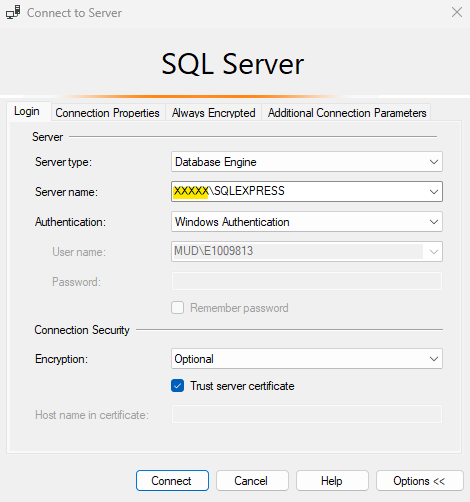
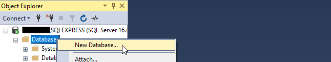
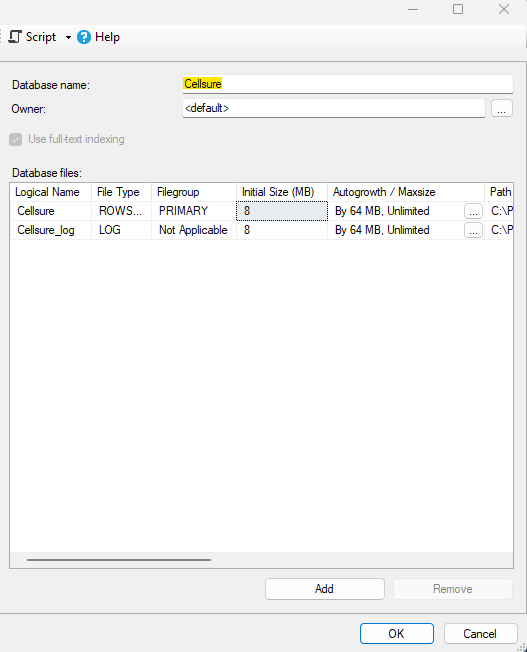
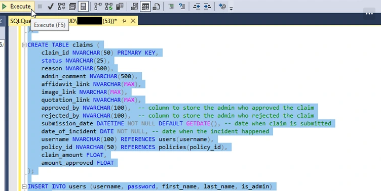

## 1. Setup the virtual environment

`python -m venv myenv`

#### 1.1. Activate the virtual environment

`myenv\Scripts\activate.bat` (terminal)

or `.\myenv\Scripts\Activate.ps1` (powershell)

#### 1.2. Install requirements

`pip install -r requirements.txt `

## 2. Setup your database.

#### 2.1. Open MS SQL Server Management

#### 2.2. In the "Connect to Server" Window, follow these settings. Write down your username for later (as highlighted in yellow)

#### 2.3. After clicking "Connect", right click on the "Databases" folder and click "New Database..."

#### 2.4. Name your database and note the name as done in step 2.2. Click OK.

#### 2.5. Right click on your newly created database and select "New Query"

#### 2.6. Copy the contents of the `SEED_DATA.sql` file and paste it into this query. Select All `(Ctrl + A)` and `Execute (F5)` as shown below.

## 3. Setup `.env` file using the `.env_template` file

#### 3.1. Rename the `.env_template` file to `.env`

#### 3.2. Open the now `.env` file and fill in the variables following the below explanations:

#### `USER = "user"` (where "user" is the name you noted from step 2.2)

#### `DB_NAME = "example"` (where "example" is the name of your database from step 2.4)

#### `LOCAL_DATABASE_URL` (NB: do not change this variable)

#### `SECRET_KEY = "anything"` (this can be anything you like)

## 5. Run the app

`python app.py`
